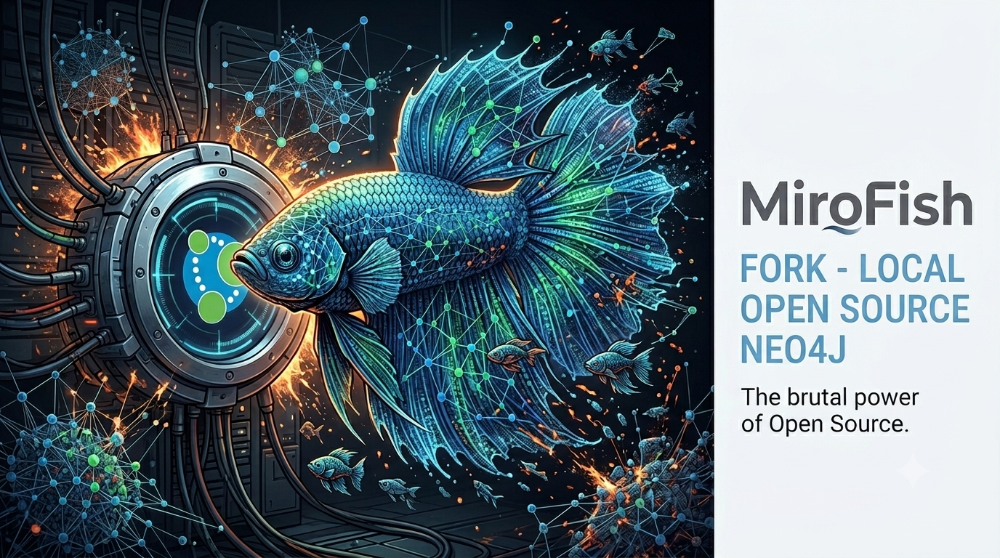
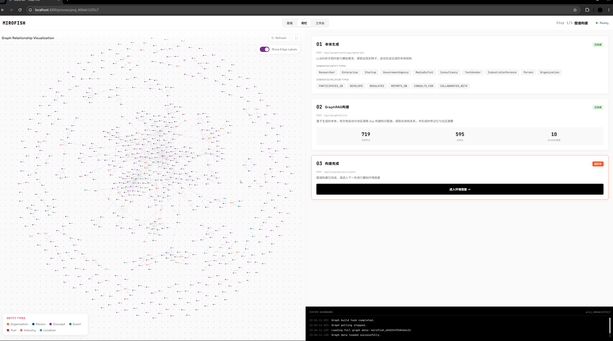
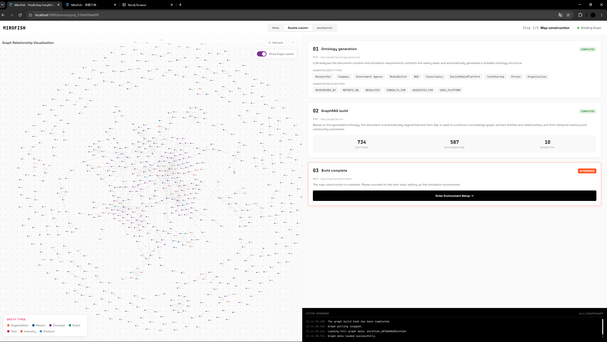
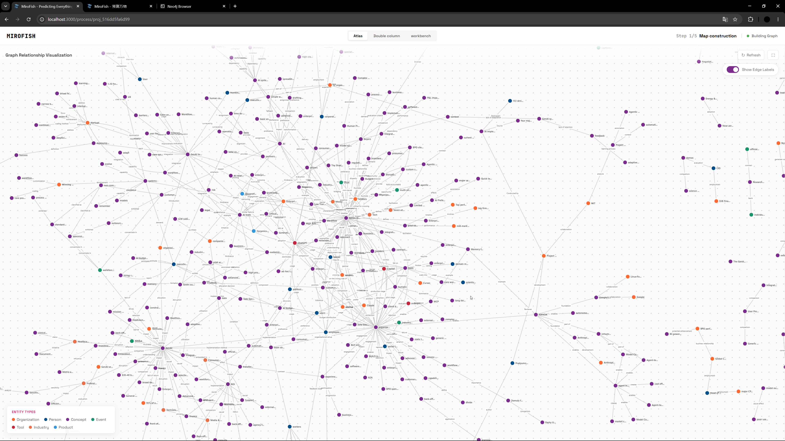
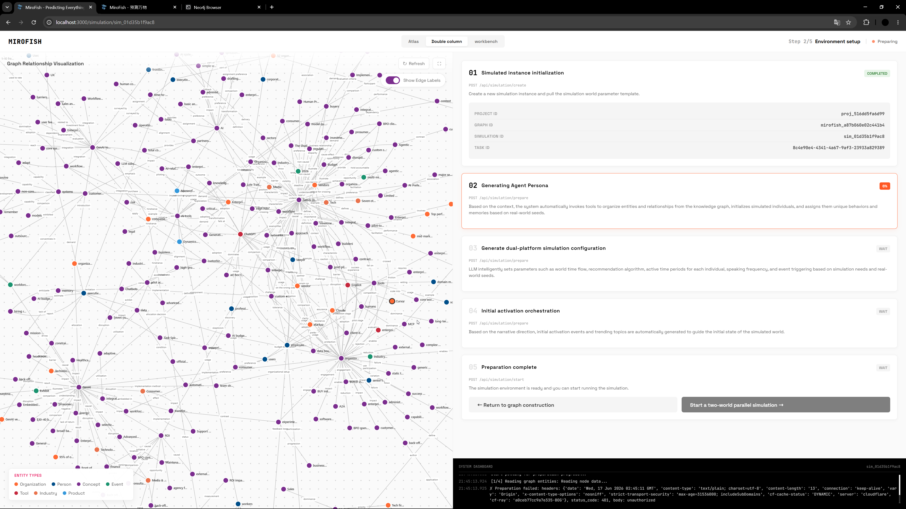
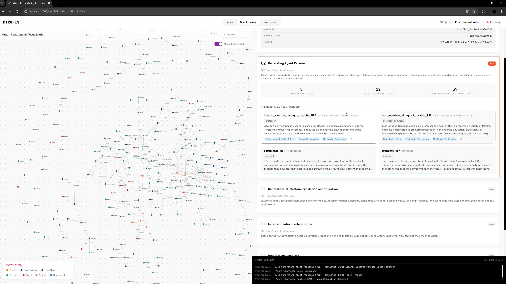
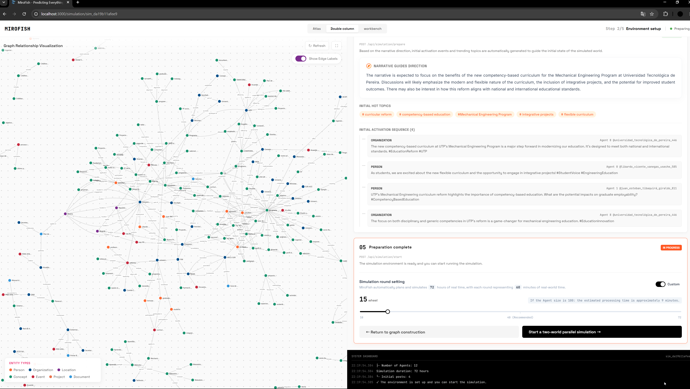
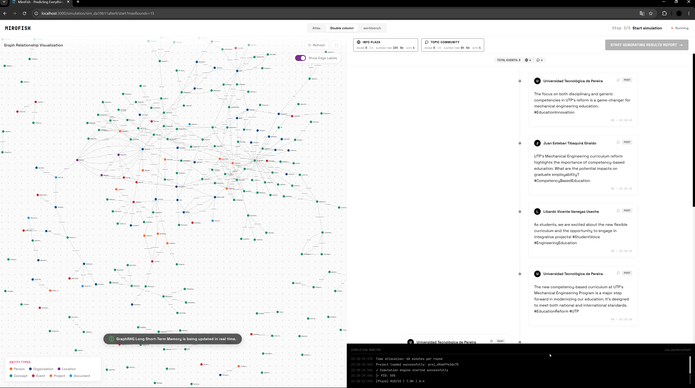
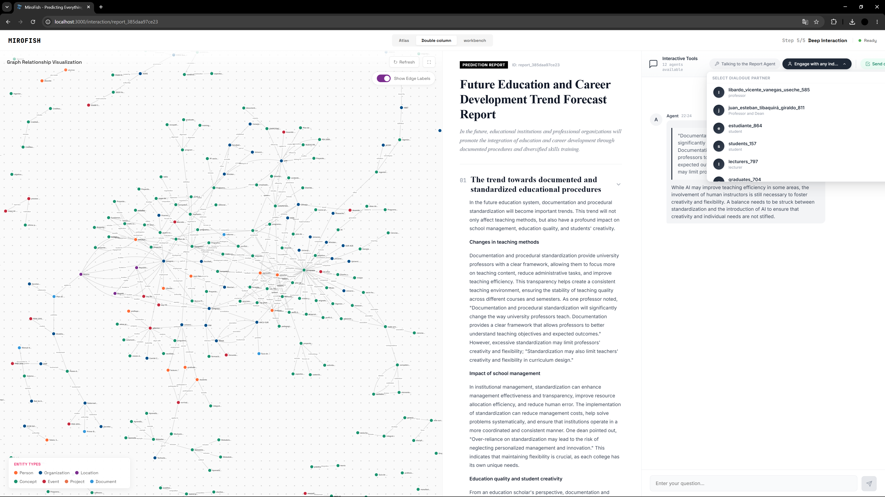

<div align="center">



# MiroFish Neo4j Fork

**Multi-Agent AI Prediction Engine — Fully Self-Hosted with Neo4j**

[](https://github.com/666ghj/MiroFish)
[](https://neo4j.com/)
[](https://www.docker.com/)
[](https://github.com/666ghj/MiroFish/blob/main/LICENSE)

*A fork of [MiroFish](https://github.com/666ghj/MiroFish) that replaces **Zep Cloud** with **Neo4j** — no vendor lock-in, no cloud dependency, fully offline.*

</div>

---

## Why This Fork?

The original [MiroFish](https://github.com/666ghj/MiroFish) depends on **Zep Cloud** — a closed-source, cloud-hosted graph database. This fork replaces it with a local **Neo4j** instance:

| | Zep Cloud (Original) | Neo4j (This Fork) |
|---|---|---|
| **Hosting** | Cloud-only | Local Docker container |
| **Cost** | Free tier limits | Completely free |
| **Privacy** | Data sent to cloud | Data stays on your machine |
| **Offline** | Requires internet | Works fully offline |
| **Open Source** | Proprietary | Neo4j Community Edition |
| **Query Language** | Custom API | Cypher (industry standard) |
| **Browser UI** | Limited | Full Neo4j Browser at `:7474` |

---

## Screenshots

<div align="center">

### MiroFish Homepage

<br/><sub>MiroFish prediction engine — upload documents and build knowledge graphs</sub>

<br/><br/>

### Knowledge Graph Building

<br/><sub>Ontology generation + graph construction from uploaded documents</sub>

<br/><br/>

### Full-Screen Knowledge Graph

<br/><sub>Interactive graph visualization with entities and relationships</sub>

<br/><br/>

### Agent Persona Generation


<br/><sub>AI-generated agent personas from the knowledge graph</sub>

<br/><br/>

### Simulation Setup

<br/><sub>Custom agent configuration before running the simulation</sub>

<br/><br/>

### Running Simulation

<br/><sub>Parallel multi-agent simulation with real-time interaction view</sub>

<br/><br/>

### Final Report & Agent Chat

<br/><sub>Comprehensive report with graph view and interactive agent Q&A</sub>

</div>

---

## Quick Start

### Prerequisites

- [Docker & Docker Compose](https://docs.docker.com/get-docker/)
- An [OpenAI API key](https://platform.openai.com/api-keys) (for LLM reasoning)

### 1. Configure Environment

```bash
cp .env.example .env
# Edit .env — add your OpenAI API key
```

### 2. Start All Services

```bash
docker compose up -d
```

### 3. Open the UI

| Service | URL | Credentials |
|---------|-----|-------------|
| **MiroFish UI** | http://localhost:3000 | — |
| **MiroFish API** | http://localhost:5001 | — |
| **Neo4j Browser** | http://localhost:7474 | `neo4j` / `mirofish2026` |
| **ChromaDB** | http://localhost:8000 | — |
| **Whisper ASR** | http://localhost:9000 | — |

---

## How It Works

All Neo4j patches are **automatically applied** on every `docker compose up` via a custom entrypoint script. No manual steps needed.

```
docker compose up -d
         │
         ▼
  ┌──────────────────┐
  │  patches/         │  Auto-applied at startup:
  │  entrypoint.sh    │  • graph_builder.py → Neo4j
  │                   │  • zep_entity_reader.py → Neo4j
  │                   │  • zep_tools.py → Neo4j monkey-patch
  │                   │  • config.py → skip Zep validation
  └──────┬───────────┘
         ▼
  ┌──────────────┐  ┌────────────┐  ┌───────────┐  ┌─────────┐
  │  MiroFish    │  │   Neo4j    │  │ ChromaDB  │  │ Whisper │
  │  :3000/:5001 │  │ :7474/:7687│  │  :8000    │  │  :9000  │
  └──────────────┘  └────────────┘  └───────────┘  └─────────┘
```

---

## Project Structure

```
.
├── .env.example              # Environment template (copy to .env)
├── .gitignore                # Keeps secrets and data out of git
├── docker-compose.yml        # All services + auto-patching entrypoint
├── README.md
│
├── images/                   # Screenshots for documentation
│   ├── banner.png
│   ├── graph-build.png
│   ├── graph-fullscreen.png
│   ├── agent-personas-dual.png
│   ├── simulation-setup.png
│   ├── simulation-running.png
│   └── final-report.png
│
└── patches/                  # Neo4j patches (auto-applied on startup)
    ├── entrypoint.sh               # Startup script that applies all patches
    ├── neo4j_graph_builder.py      # Replaces Zep graph builder with Neo4j
    ├── neo4j_entity_reader.py      # Replaces Zep entity reader with Neo4j
    ├── neo4j_graph_api.py          # Flask blueprint for /api/neo4j/ endpoints
    └── patch_zep_tools.py          # Monkey-patches ZepToolsService → Neo4j
```

---

## Configuration

| Variable | Description | Required |
|----------|-------------|----------|
| `LLM_API_KEY` | OpenAI API key (or compatible) | Yes |
| `LLM_BASE_URL` | LLM API base URL | Yes |
| `LLM_MODEL_NAME` | Model name (e.g. `gpt-4o`) | Yes |
| `ZEP_API_KEY` | Placeholder (needed by original image to start) | Yes* |
| `NEO4J_URI` | Neo4j Bolt URI | No (default in compose) |
| `NEO4J_PASSWORD` | Neo4j password | No (default: `mirofish2026`) |

---

## What's Working

| Feature | Status |
|---------|--------|
| MiroFish UI at localhost:3000 | ✅ Working |
| LLM-powered ontology generation | ✅ Working |
| Knowledge graph building → **Neo4j** | ✅ Working |
| Neo4j Browser at localhost:7474 | ✅ Working |
| ChromaDB vector embeddings | ✅ Working |
| Whisper audio transcription | ✅ Working |
| Entity reading from Neo4j | ✅ Working |
| Agent persona generation | ✅ Working |
| Multi-agent simulation | ✅ Working |
| Final report + interactive Q&A | ✅ Working |
| Auto-patching on `docker compose up` | ✅ Working |

---

## Acknowledgments

Fork of [**MiroFish**](https://github.com/666ghj/MiroFish) by the MiroFish team. Simulation engine powered by [OASIS](https://github.com/camel-ai/oasis) from CAMEL-AI.

**Infrastructure:** [Neo4j](https://neo4j.com/) · [ChromaDB](https://www.trychroma.com/) · [OpenAI Whisper](https://openai.com/research/whisper) · [OpenAI GPT](https://openai.com/)

---

## License

Based on [MiroFish](https://github.com/666ghj/MiroFish) — licensed under [AGPL-3.0](https://github.com/666ghj/MiroFish/blob/main/LICENSE).

---

<div align="center">

*Built by [@0xrphl](https://github.com/0xrphl)*

</div>
